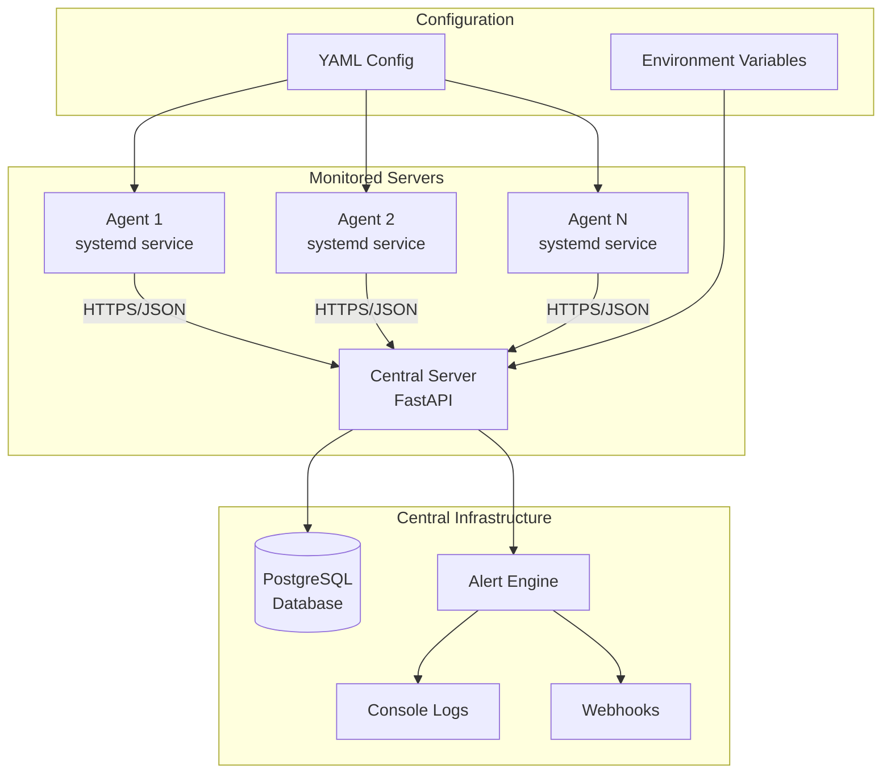

# Linux Server Health Monitoring System - Design Document

## Overview

The Linux Server Health Monitoring System is a distributed monitoring solution built with Python that provides real-time visibility into Linux server health across multiple machines. The system employs an agent-based architecture where lightweight Python agents collect system metrics and transmit them securely to a centralized FastAPI server for storage, analysis, and alerting.

The design prioritizes simplicity, security, and extensibility while maintaining minimal resource overhead on monitored systems. The solution supports both small-scale deployments and larger distributed environments through its scalable architecture and containerized deployment options.

## Architecture

The system follows a hub-and-spoke architecture with the following key components:



**Communication Flow:**

1. Agents collect system metrics using psutil library
2. Metrics are serialized to JSON and sent via HTTP POST with API key authentication
3. Central server validates requests, stores data in PostgreSQL, and evaluates alert rules
4. Alert engine triggers notifications based on configurable thresholds
5. System maintains server health status and last-seen timestamps

## Components and Interfaces

### Agent Component

**Purpose:** Collects system metrics and transmits them to the central server

**Key Classes:**

- `MetricsCollector`: Interfaces with psutil to gather system statistics
- `SystemdMonitor`: Monitors systemd service status
- `HTTPTransmitter`: Handles secure communication with central server
- `ConfigManager`: Manages YAML and environment variable configuration
- `AgentService`: Main service orchestrator

**Interfaces:**

```python
class MetricsCollector:
    def collect_cpu_usage() -> float
    def collect_memory_usage() -> dict
    def collect_disk_usage() -> list[dict]
    def collect_load_average() -> dict
    def collect_uptime() -> int

class SystemdMonitor:
    def get_failed_services() -> list[dict]

class HTTPTransmitter:
    def send_metrics(data: dict, api_key: str) -> bool
    def authenticate(api_key: str) -> bool
```

### Central Server Component

**Purpose:** Receives, stores, and processes metrics from multiple agents

**Key Classes:**

- `MetricsAPI`: FastAPI endpoints for receiving agent data
- `DatabaseManager`: PostgreSQL operations and connection management
- `AuthenticationService`: API key validation and security
- `AlertEngine`: Rule evaluation and notification dispatch
- `HealthStatusManager`: Server status classification logic

**API Endpoints:**

```
POST /api/v1/metrics
  - Accepts JSON metrics from agents
  - Requires API key authentication
  - Returns acknowledgment

GET /api/v1/health
  - Health check endpoint
  - Returns server status

POST /api/v1/register
  - Agent registration endpoint
  - Generates API keys
```

### Database Schema

**Tables:**

- `servers`: Server registration and metadata
- `metrics`: Time-series metrics data
- `api_keys`: Hashed authentication keys
- `alerts`: Alert history and configuration
- `health_status`: Current server health states

## Data Models

### Metrics Data Structure

```json
{
  "server_id": "server-001",
  "timestamp": "2024-12-15T10:30:00Z",
  "cpu_usage": 45.2,
  "memory": {
    "total": 8589934592,
    "used": 4294967296,
    "percentage": 50.0
  },
  "disk_usage": [
    {
      "mountpoint": "/",
      "total": 107374182400,
      "used": 53687091200,
      "percentage": 50.0
    }
  ],
  "load_average": {
    "1min": 1.2,
    "5min": 1.1,
    "15min": 0.9
  },
  "uptime": 86400,
  "failed_services": [
    {
      "name": "nginx",
      "status": "failed",
      "since": "2024-12-15T09:15:00Z"
    }
  ]
}
```

### Configuration Models

```yaml
# Agent Configuration
agent:
  server_url: "https://monitoring.example.com"
  api_key: "${MONITORING_API_KEY}"
  collection_interval: 60
  retry_attempts: 3
  retry_backoff: 2.0

# Server Configuration
server:
  host: "0.0.0.0"
  port: 8000
  database_url: "${DATABASE_URL}"
  alert_rules:
    cpu_threshold: 90.0
    disk_threshold: 80.0
    offline_timeout: 300
```

## Correctness Properties

_A property is a characteristic or behavior that should hold true across all valid executions of a system-essentially, a formal statement about what the system should do. Properties serve as the bridge between human-readable specifications and machine-verifiable correctness guarantees._

Based on the prework analysis, the following properties have been identified after eliminating redundancy:

**Property 1: System metrics collection completeness**
_For any_ Linux system state, when the Agent collects system metrics, all returned metric objects should contain valid CPU percentage (0-100), memory data structure with total/used/percentage fields, disk usage list with valid mountpoints and percentages, load average with 1min/5min/15min values, and positive uptime value
**Validates: Requirements 1.1, 1.2, 1.3, 1.4, 1.5**

**Property 2: Failed service detection accuracy**
_For any_ systemd service state, when the Agent scans for failed services, all returned service entries should contain name and status fields, and any service with "failed" status should be included in the results
**Validates: Requirements 2.1, 2.2**

**Property 3: Metrics JSON serialization round-trip**
_For any_ valid metrics object, serializing to JSON and parsing back should produce an equivalent object with all required fields preserved
**Validates: Requirements 3.1**

**Property 4: Authentication header inclusion**
_For any_ HTTP request sent by the Agent, the request should include the API key in the authorization header
**Validates: Requirements 3.3**

**Property 5: Exponential backoff retry behavior**
_For any_ sequence of network failures, retry attempts should follow exponential backoff timing with each retry delay being approximately double the previous delay
**Validates: Requirements 3.5**

**Property 6: Configuration parsing consistency**
_For any_ valid YAML configuration file, parsing should produce a configuration object where environment variables override YAML values when both are present
**Validates: Requirements 5.2, 5.3**

**Property 7: API key authentication validation**
_For any_ incoming request to the Central Server, only requests with valid API keys should be accepted, and invalid or missing keys should be rejected
**Validates: Requirements 6.1**

**Property 8: Metrics storage and retrieval consistency**
_For any_ valid metrics data received by the Central Server, storing the data and then querying it back should return equivalent metric values with updated last-seen timestamp
**Validates: Requirements 6.2, 6.3**

**Property 9: Server health status classification**
_For any_ set of server metrics and last-seen timestamp, the health status should be classified as Healthy when metrics are normal and recent, Warning when thresholds are exceeded, and Down when last-seen exceeds timeout
**Validates: Requirements 6.4**

**Property 10: Alert threshold triggering**
_For any_ metrics with CPU usage above 90% or disk usage above 80%, or agent offline beyond timeout, the appropriate alert should be triggered and logged
**Validates: Requirements 7.1, 7.2, 7.3, 7.4**

**Property 11: Webhook notification delivery**
_For any_ triggered alert when webhook URLs are configured, HTTP POST requests should be sent to all configured webhook endpoints with alert details
**Validates: Requirements 7.5**

**Property 12: API key security properties**
_For any_ generated API key, it should have sufficient entropy (minimum 32 bytes), use cryptographically secure random generation, and be stored as a hash in the database with the original key never persisted
**Validates: Requirements 9.1, 9.2**

**Property 13: Input validation security**
_For any_ input data received by the Central Server, malicious payloads should be rejected and not cause injection vulnerabilities or system compromise
**Validates: Requirements 9.3**

**Property 14: Rate limiting enforcement**
_For any_ client making requests to the Central Server, when request rate exceeds configured limits, subsequent requests should be rejected with appropriate HTTP status codes
**Validates: Requirements 9.4**

## Error Handling

### Agent Error Handling

- **Network Failures**: Implement exponential backoff retry mechanism with maximum retry attempts
- **Configuration Errors**: Validate configuration on startup and provide clear error messages
- **System Access Errors**: Handle permissions issues gracefully and log appropriate warnings
- **Metric Collection Failures**: Continue operation with partial metrics and log collection errors

### Central Server Error Handling

- **Database Connection Issues**: Implement connection pooling with automatic reconnection
- **Invalid Metrics Data**: Validate incoming data and reject malformed requests with detailed error responses
- **Authentication Failures**: Log security events and implement rate limiting for failed authentication attempts
- **Alert Delivery Failures**: Retry webhook deliveries with exponential backoff and log failures

### Data Integrity

- **Database Transactions**: Use transactions for multi-table operations to ensure consistency
- **Metric Validation**: Validate metric ranges and data types before storage
- **Timestamp Handling**: Use UTC timestamps consistently and validate chronological ordering
- **Duplicate Detection**: Handle duplicate metric submissions gracefully

## Testing Strategy

### Unit Testing Approach

The system will use pytest for unit testing with the following focus areas:

- **Configuration Management**: Test YAML parsing, environment variable handling, and validation
- **Metric Collection**: Test individual psutil wrapper functions with mocked system calls
- **API Endpoints**: Test FastAPI endpoints with test client and mocked database
- **Authentication**: Test API key generation, hashing, and validation logic
- **Alert Logic**: Test threshold evaluation and notification triggering

### Property-Based Testing Approach

The system will use Hypothesis for property-based testing to verify universal properties:

- **Configuration**: Generate random valid configurations and verify parsing consistency
- **Metrics Processing**: Generate random metric data and verify storage/retrieval round-trips
- **Authentication**: Generate random API keys and verify security properties
- **Alert Rules**: Generate random metric values and verify correct alert triggering
- **Input Validation**: Generate malicious inputs and verify proper rejection

**Testing Configuration:**

- Property-based tests will run a minimum of 100 iterations per test
- Each property-based test will be tagged with comments referencing the specific correctness property
- Test data generators will create realistic but varied input scenarios
- Both positive and negative test cases will be covered through property generation strategies

### Integration Testing

- **End-to-End Flows**: Test complete agent-to-server communication cycles
- **Database Integration**: Test with real PostgreSQL instances using test containers
- **Docker Compose Testing**: Verify containerized deployment scenarios
- **Security Testing**: Test authentication, authorization, and input validation with real HTTP requests
