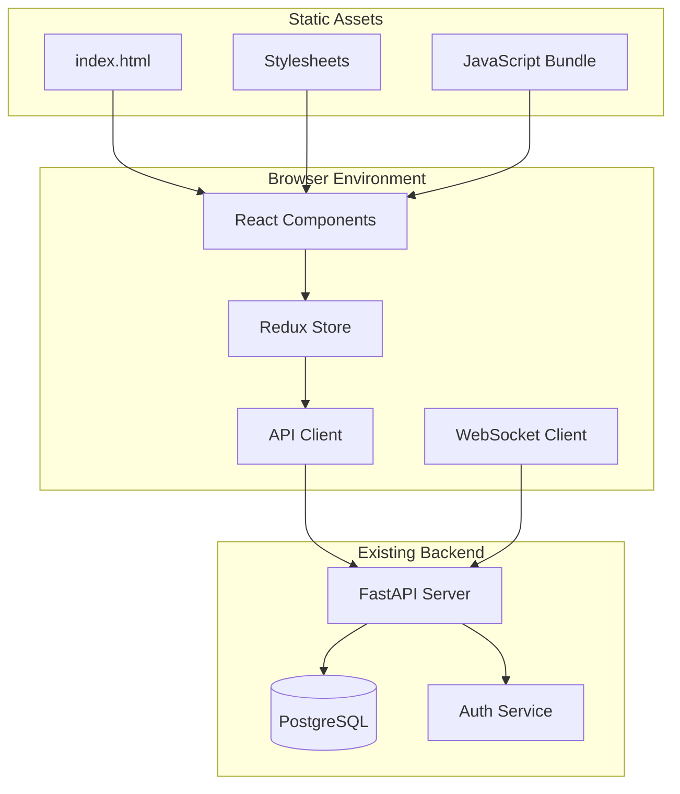

# Web Dashboard Design Document

## Overview

The Web Dashboard is a modern, responsive single-page application (SPA) built with React and TypeScript that provides a comprehensive web interface for the Linux Server Health Monitoring System. The dashboard integrates seamlessly with the existing FastAPI backend through REST APIs, offering real-time visualization of server metrics, alert management, and administrative functions.

The design emphasizes usability, performance, and security while maintaining compatibility with the existing monitoring infrastructure. The dashboard supports responsive design for desktop, tablet, and mobile access, with real-time updates and intuitive navigation.

## Architecture

The web dashboard follows a modern frontend architecture pattern with clear separation of concerns:



**Data Flow:**

1. React components render UI based on Redux state
2. User interactions dispatch actions to update state
3. API client makes HTTP requests to existing FastAPI endpoints
4. WebSocket client receives real-time updates for metrics and alerts
5. State management handles caching and optimistic updates
6. Components re-render automatically when state changes

## Components and Interfaces

### Frontend Components

**Core Layout Components:**

- `App`: Root application component with routing and global state
- `Header`: Navigation bar with user info and logout functionality
- `Sidebar`: Navigation menu for different dashboard sections
- `MainContent`: Content area that renders current page components
- `Footer`: Status information and connection indicators

**Dashboard Components:**

- `ServerGrid`: Grid layout displaying all server cards
- `ServerCard`: Individual server status and metrics display
- `ServerDetails`: Detailed view for individual server metrics
- `MetricsChart`: Interactive charts for historical data visualization
- `AlertPanel`: Alert status and notification display
- `AlertHistory`: Historical alert log with filtering

**Management Components:**

- `ServerManagement`: Server registration and API key management
- `Settings`: Dashboard configuration and preferences
- `LoginForm`: Authentication interface
- `UserProfile`: User account and session management

### API Integration Layer

**API Client Interface:**

```typescript
interface ApiClient {
  // Server data
  getServers(): Promise<Server[]>;
  getServerMetrics(serverId: string, timeRange: string): Promise<Metrics[]>;
  registerServer(serverData: ServerRegistration): Promise<ApiKey>;

  // Authentication
  login(credentials: LoginCredentials): Promise<AuthToken>;
  logout(): Promise<void>;
  refreshToken(): Promise<AuthToken>;

  // Alerts
  getAlerts(): Promise<Alert[]>;
  getAlertHistory(filters: AlertFilters): Promise<Alert[]>;

  // Settings
  getSettings(): Promise<DashboardSettings>;
  updateSettings(settings: DashboardSettings): Promise<void>;
}
```

**WebSocket Interface:**

```typescript
interface WebSocketClient {
  connect(): void;
  disconnect(): void;
  onMetricsUpdate(callback: (metrics: ServerMetrics) => void): void;
  onAlertUpdate(callback: (alert: Alert) => void): void;
  onServerStatusChange(callback: (status: ServerStatus) => void): void;
}
```

### State Management

**Redux Store Structure:**

```typescript
interface AppState {
  auth: {
    user: User | null;
    token: string | null;
    isAuthenticated: boolean;
  };
  servers: {
    list: Server[];
    selectedServer: Server | null;
    loading: boolean;
    error: string | null;
  };
  metrics: {
    current: Record<string, ServerMetrics>;
    historical: Record<string, HistoricalMetrics>;
    loading: boolean;
  };
  alerts: {
    active: Alert[];
    history: Alert[];
    unreadCount: number;
  };
  ui: {
    sidebarOpen: boolean;
    theme: "light" | "dark";
    refreshInterval: number;
  };
}
```

## Data Models

### Frontend Data Models

```typescript
interface Server {
  id: string;
  hostname: string;
  ipAddress: string;
  status: "online" | "offline" | "warning";
  lastSeen: string;
  registeredAt: string;
  currentMetrics?: ServerMetrics;
}

interface ServerMetrics {
  serverId: string;
  timestamp: string;
  cpuUsage: number;
  memory: {
    total: number;
    used: number;
    percentage: number;
  };
  diskUsage: DiskUsage[];
  loadAverage: {
    oneMin: number;
    fiveMin: number;
    fifteenMin: number;
  };
  uptime: number;
  failedServices: FailedService[];
}

interface Alert {
  id: string;
  serverId: string;
  type: "cpu" | "memory" | "disk" | "offline";
  severity: "warning" | "critical";
  message: string;
  triggeredAt: string;
  resolvedAt?: string;
  acknowledged: boolean;
}

interface DashboardSettings {
  refreshInterval: number;
  alertThresholds: {
    cpu: number;
    memory: number;
    disk: number;
  };
  notifications: {
    enabled: boolean;
    webhookUrls: string[];
  };
  display: {
    theme: "light" | "dark";
    compactMode: boolean;
    chartsEnabled: boolean;
  };
}
```

### API Response Models

The dashboard will consume existing API responses from the FastAPI server, mapping them to frontend models as needed.

## Correctness Properties

_A property is a characteristic or behavior that should hold true across all valid executions of a system-essentially, a formal statement about what the system should do. Properties serve as the bridge between human-readable specifications and machine-verifiable correctness guarantees._

<function_calls>
<invoke name="prework">
<parameter name="featureName">web-dashboard

**Property 1: Server grid rendering completeness**
_For any_ API response containing server data, when the Dashboard loads, all servers in the response should be rendered as Server_Cards in the grid
**Validates: Requirements 1.1**

**Property 2: Online server display accuracy**
_For any_ server with online status and current metrics, the Server_Card should display CPU, memory, and disk usage values with appropriate visual indicators
**Validates: Requirements 1.2**

**Property 3: Offline server indication**
_For any_ server with offline status, the Server_Card should clearly show offline status and display the last-seen timestamp
**Validates: Requirements 1.3**

**Property 4: Real-time metrics update timing**
_For any_ metrics update received via WebSocket or polling, the Dashboard should refresh the display within 30 seconds of receiving the update
**Validates: Requirements 1.4**

**Property 5: Server navigation consistency**
_For any_ Server_Card click event, the Dashboard should navigate to the detailed server view for that specific server
**Validates: Requirements 2.1**

**Property 6: Historical charts rendering**
_For any_ server detail view with available historical data, Metrics_Charts should be rendered for CPU, memory, and disk usage
**Validates: Requirements 2.2**

**Property 7: Time range selection functionality**
_For any_ chart display, time range controls should be present and selecting different ranges (1h, 6h, 24h, 7d) should trigger appropriate API calls
**Validates: Requirements 2.3**

**Property 8: Failed services display completeness**
_For any_ server metrics containing failed services, all failed services should be listed with their names and timestamps
**Validates: Requirements 2.4**

**Property 9: System information display**
_For any_ metrics data containing load average and uptime, this information should be displayed in the server details view
**Validates: Requirements 2.5**

**Property 10: Active alerts display**
_For any_ active alerts in the system, the Alert_Panel should display all current alerts with appropriate status indicators
**Validates: Requirements 3.1**

**Property 11: Real-time alert notifications**
_For any_ new alert triggered, visual notifications should appear immediately without requiring page refresh
**Validates: Requirements 3.2**

**Property 12: Alert history completeness**
_For any_ alert history request, all past alerts should be displayed with timestamps and resolution status
**Validates: Requirements 3.3**

**Property 13: Alert severity color coding**
_For any_ alert with defined severity level, appropriate color coding should be applied to indicate warning or critical status
**Validates: Requirements 3.4**

**Property 14: Alert detail information**
_For any_ alert selected for details, the display should show alert descriptions and affected server information
**Validates: Requirements 3.5**

**Property 15: Responsive layout adaptation**
_For any_ screen orientation change, the Dashboard should automatically adjust layout and component sizing to fit the new orientation
**Validates: Requirements 4.4**

**Property 16: Automatic metrics refresh**
_For any_ Dashboard session, server metrics should be automatically updated every 30 seconds through API calls or WebSocket updates
**Validates: Requirements 5.1**

**Property 17: Immediate alert delivery**
_For any_ new alert triggered, notifications should be displayed immediately via real-time update mechanisms
**Validates: Requirements 5.2**

**Property 18: Status update timeliness**
_For any_ server status change (online/offline), status indicators should be updated within 60 seconds
**Validates: Requirements 5.3**

**Property 19: Network error handling**
_For any_ network connectivity loss, connection status should be displayed and automatic retry should be attempted
**Validates: Requirements 5.4**

**Property 20: Error state indication**
_For any_ failed API update, error indicators should be shown and manual refresh options should be provided
**Validates: Requirements 5.5**

**Property 21: Server registration workflow**
_For any_ server registration request, the process should generate and display API keys for agent configuration
**Validates: Requirements 6.2**

**Property 22: Server details display**
_For any_ registered server, the server list should show server details and registration timestamps
**Validates: Requirements 6.3**

**Property 23: API key management**
_For any_ API key regeneration request, secure key management functionality should be provided
**Validates: Requirements 6.4**

**Property 24: Server deregistration cleanup**
_For any_ server deregistration, the server should be removed from monitoring and associated data should be cleaned up
**Validates: Requirements 6.5**

**Property 25: Authentication validation**
_For any_ login attempt, credentials should be validated against the secure authentication system
**Validates: Requirements 7.2**

**Property 26: Authentication error handling**
_For any_ failed authentication attempt, appropriate error messages should be displayed
**Validates: Requirements 7.3**

**Property 27: Session expiry handling**
_For any_ expired session, automatic redirect to login should occur with session timeout notification
**Validates: Requirements 7.4**

**Property 28: Logout session cleanup**
_For any_ logout action, all session data should be cleared and redirect to login page should occur
**Validates: Requirements 7.5**

**Property 29: Alert threshold configuration**
_For any_ alert threshold setting, CPU, memory, and disk warning levels should be customizable and saved
**Validates: Requirements 8.2**

**Property 30: Notification configuration**
_For any_ notification setting, webhook URLs and notification preferences should be configurable
**Validates: Requirements 8.3**

**Property 31: Settings persistence**
_For any_ settings save operation, user preferences should be persisted and applied immediately
**Validates: Requirements 8.4**

**Property 32: Settings reset functionality**
_For any_ configuration reset request, default settings should be restored with user confirmation
**Validates: Requirements 8.5**

**Property 33: API endpoint compatibility**
_For any_ Dashboard API communication, existing REST API endpoints should be used without modification
**Validates: Requirements 9.1**

**Property 34: JSON format compatibility**
_For any_ data display, the Dashboard should correctly consume the same JSON format used by monitoring agents
**Validates: Requirements 9.2**

**Property 35: Authentication and rate limiting compliance**
_For any_ API access, existing authentication and rate limiting mechanisms should be respected
**Validates: Requirements 9.5**

## Error Handling

### Frontend Error Handling

- **Network Failures**: Implement retry mechanisms with exponential backoff and user-friendly error messages
- **API Errors**: Handle HTTP error codes gracefully with appropriate user feedback and fallback options
- **Authentication Errors**: Redirect to login on authentication failures and provide clear error messages
- **Data Validation**: Validate user inputs client-side before API submission with real-time feedback
- **WebSocket Disconnections**: Automatically reconnect WebSocket connections and fall back to polling if needed

### User Experience Error Handling

- **Loading States**: Show loading indicators during API calls and data fetching operations
- **Empty States**: Display helpful messages and actions when no data is available
- **Offline Mode**: Detect network connectivity and show offline indicators with cached data when possible
- **Browser Compatibility**: Gracefully handle unsupported browser features with polyfills or fallbacks

### Data Integrity

- **State Consistency**: Use Redux for predictable state management and prevent race conditions
- **Cache Management**: Implement proper cache invalidation and data freshness checks
- **Optimistic Updates**: Use optimistic UI updates with rollback on failure
- **Real-time Sync**: Ensure WebSocket updates don't conflict with API-fetched data

## Testing Strategy

### Unit Testing Approach

The dashboard will use Jest and React Testing Library for unit testing with focus on:

- **Component Rendering**: Test that components render correctly with various props and state
- **User Interactions**: Test click handlers, form submissions, and navigation
- **State Management**: Test Redux actions, reducers, and selectors
- **API Integration**: Test API client functions with mocked responses
- **Error Handling**: Test error states and recovery mechanisms

### Property-Based Testing Approach

The system will use fast-check for property-based testing to verify universal properties:

- **Component Props**: Generate random valid props and verify components render without errors
- **API Responses**: Generate random valid API responses and verify correct data display
- **User Inputs**: Generate random user inputs and verify proper validation and handling
- **State Transitions**: Generate random state changes and verify UI consistency
- **Responsive Design**: Generate random viewport sizes and verify layout adaptation

**Testing Configuration:**

- Property-based tests will run a minimum of 100 iterations per test
- Each property-based test will be tagged with comments referencing the specific correctness property
- Test data generators will create realistic but varied input scenarios for React components
- Both positive and negative test cases will be covered through property generation strategies

### Integration Testing

- **End-to-End Flows**: Test complete user workflows from login to data visualization
- **API Integration**: Test with real backend API endpoints using test environments
- **WebSocket Testing**: Test real-time updates with WebSocket connections
- **Cross-Browser Testing**: Verify compatibility across different browsers and devices
- **Performance Testing**: Test rendering performance with large datasets and frequent updates

### Visual Testing

- **Component Screenshots**: Use visual regression testing for UI components
- **Responsive Design**: Test layout across different screen sizes and orientations
- **Theme Testing**: Verify light and dark theme implementations
- **Accessibility Testing**: Test keyboard navigation and screen reader compatibility
